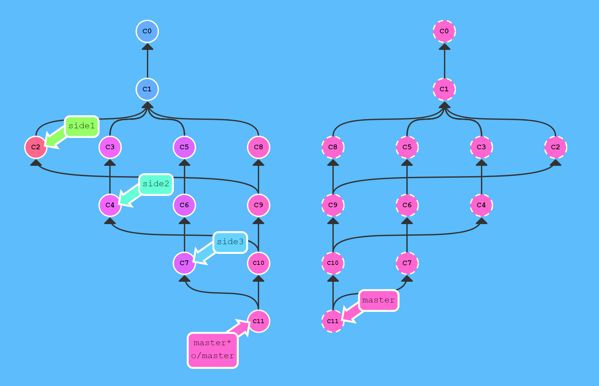

# [Learn Git Branching](https://learngitbranching.js.org/)

## Git Local Repository - Introduction Sequence

### 1. Git Commits

A commit in a git repository records a snapshot of all the files in your directory. It's like a giant copy and paste, but even better!

Git wants to keep commits as lightweight as possible though, so it **doesn't just blindly copy the entire directory** every time you commit. It can (when possible) compress a commit as a set of changes, or a "delta", from one version of the repository to the next.

Git also maintains a history of which commits were made when. That's why most commits have ancestor commits above them—we can designate this with arrows in a visualization. Maintaining history is great for everyone working on the project!

It's a lot to take in, but for now you can think of commits as snapshots of the project. Commits are very lightweight and switching between them is wicked fast!
- ***"git commit -m "[descriptive message]""***
- Records file snapshots permanently in version history

### 2. Git Branches

Branches in Git are incredibly lightweight as well. ***They are simply pointers to a specific commit***—nothing more. This is why many Git enthusiasts chant the mantra: branch early, and branch often.

Because there is no storage/memory overhead with making many branches, it's easier to logically divide up your work than have big beefy branches.

When we start mixing branches and commits, we will see how these two features combine. For now, though, just remember that a branch essentially says, "***I want to include the work of this commit and all parent commits.***"
- ***"git branch [branch-name]"***
- Creates a new branch
Let's tell git we want to check out the branch with "git checkout 檢出 [branch-name]".
This will put us on the new branch before committing our changes.
By the way, here's a shortcut: if you want to create a new branch AND check it out at the same time, you can simply type ***"git checkout -b [branch-name]"***.

### 3. Branches and Merging

Great! We now know how to commit and branch. Now we need to learn some kind of way of combining the work from two different branches together. ***This will allow us to branch off, develop a new feature, and then combine it back in.***

The first method to combine work that we will examine is git merge. Merging in Git creates a special commit that has **two unique parents**. A commit with two parents essentially means "I want to include all the work from this parent over here and this one over here, and the set of all their parents."

It's easier with visuals, let's check it out in the next view
- ***"git merge [branch]"***
- Combines the specified branch's history into the current branch

### 4. Git Rebase

The second way of combining work between branches is rebasing. Rebasing essentially ***takes a set of commits, "copies" them, and plops 輕輕地放下 them down somewhere else***.

While this sounds confusing, the advantage of rebasing is that it can be used to make a nice linear sequence of commits. The commit log / history of the repository will be a lot cleaner if only rebasing is allowed.
- ***"git rebase [branch]"***
- The branch specified is the branch one wants to rebase the current branch on

## Ramping up

### Moving around in Git

Before we get to some of the more advanced features of Git, it's important to understand different ways to move through the commit tree that represents your project.

Once you're comfortable moving around, your powers with other git commands will be amplified!

#### HEAD

First, we have to talk about "HEAD". ***HEAD is the symbolic name for the currently checked out commit***—it's essentially what commit you're working on top of.

HEAD always points to the most recent commit which is reflected in the working tree. Most git commands which make changes to the working tree will start by changing HEAD.

Normally HEAD points to a branch name (like bugFix). When you commit, the status of bugFix is altered and this change is visible through HEAD.

#### Detaching HEAD

Detaching HEAD just means attaching it to a commit instead of a branch. This is what it looks like beforehand 事先: HEAD -> master -> C1
After entering the command "git checkout C1", we now have: HEAD -> C1

### 2. Relative Refs

Moving around in Git by specifying commit hashes can get a bit tedious. In the real world you won't have a nice commit tree visualization next to your terminal, so you'll have to use ***"git log"*** to see hashes.

Furthermore, hashes are usually a lot longer in the real Git world as well. For instance, the hash of the commit that introduced the previous level is "fed2da64c0efc5293610bdd892f82a58e8cbc5d8". Doesn't exactly roll off the tongue...

The upside is that Git is smart about hashes. It only requires you to specify enough characters of the hash until it uniquely identifies the commit. So, I can **type "fed2" instead of the long string above**.

Like I said, specifying commits by their hash isn't the most convenient thing ever, which is why Git has relative refs. They are awesome!

With relative refs, you can start somewhere memorable (like the branch "bugFix" or "HEAD") and work from there.

Relative commits are powerful, but we will introduce two simple ones here:
- ***Moving upwards one commit at a time with "^"***
- ***Moving upwards a number of times with "~\<num\>"***

Let's look at the Caret (^) operator first. Each time you append that to a ref name, you are telling Git to find the parent of the specified commit.

So, saying "master^" is equivalent to "the first parent of 'master'".
"master^^" is the grandparent (second-generation ancestor) of "master"

### 3. The "~" operator

Say you want to move a lot of levels up in the commit tree. It might be tedious to type ^ several times, so Git also has the tilde (~) operator.

The tilde operator (optionally) takes in a trailing number that specifies the number of parents you would like to ascend.

#### Branch forcing

You're an expert on relative refs now, so let's actually use them for something.

One of the most common ways I use relative refs is to move branches around. You can directly reassign a branch to a commit with the "-f" option. So, something like: ***"git branch -f master HEAD~3"*** moves (by force) the master branch to three parents behind HEAD.

### 4. Reversing Changes in Git

There are many ways to reverse changes in Git. <u>**And just like committing**</u>, reversing changes in Git has both a low-level component (staging individual files or chunks) and a high-level component (how the changes are actually reversed). Our application will focus on the latter.

There are two primary ways to undo changes in Git—one is using ***"git reset"*** (e.g. "git reset HEAD~1") and the other is using ***"git revert"*** (e.g. "git revert HEAD").

#### Git Reset

"git reset" reverts changes by moving a branch reference backwards in time to an older commit. In this sense you can think of it as "rewriting history"; "git reset" will move a branch backwards as if the commit had never been made in the first place.

#### Git Revert

While resetting works great for local branches on your own machine, its method of "rewriting history" doesn't work for remote branches that others are using.

In order to reverse changes and share those reversed changes with others, we need to use "git revert".

When the command "git revert [commit]” is entered, a new commit is introduced—it just happens to introduce changes that exactly reverses the specified commit.

## Moving Work Around

### 1. Moving Work Around

So far, we've covered the basics of git—committing, branching, and moving around in the source tree. Just these concepts **are enough to leverage 90% of the power of git repositories** and cover the main needs of developers.

That remaining 10%, however, can be quite useful during complex workflows (or when you've gotten yourself into a bind 困境. The next concept we're going to cover is "moving work around"—in other words, it's a way for developers to say "I want this work here and that work there" in precise, eloquent 有說明力的, flexible ways.

This may seem like a lot, but it's a simple concept.

#### Git Cherry-pick

The first command in this series is called "git cherry-pick". It takes on the following form:
- ***"git cherry-pick \<Commit1\> \<Commit2\> <...>"***

It's a very straightforward way of saying that you would like to copy a series of commits below your current location ("HEAD"). I personally love "cherry-picking" because there is very little magic involved and it's easy to understand.

### 2. Git Interactive Rebase

Git cherry-pick is great when you know which commits you want (and you know their corresponding hashes) —it's hard to beat the simplicity it provides.

But what about the situation where you don't know what commits you want? Thankfully git has you covered there as well! We can use interactive rebasing for this.

All interactive rebase means is ***using the "rebase" command with the "-i" option.***

If you include this option, git will open up a UI to show you which commits are about to be copied below the target of the rebase. It also shows their commit hashes and messages, which is great for getting a bearing 清楚所在方位 on what's what.

## A Mixed Bag

### 1. Locally stacked commits

Here's a development situation that often happens: I'm trying to track down a bug, but it is quite elusive. In order to aid in my detective work, I put in a few debug commands and a few print statements.

All of these debugging/print statements are in their own commits. Finally, I track down the bug, fix it, and rejoice!

Only problem is that I now need to get my "bugfix" back into the "master" branch. If I simply fast-forwarded "master", then "master" would get all my debug statements which is undesirable. There has to be another way...

We need to tell git to copy only one of the commits over. This is just like the levels earlier on moving work around -- we can use the same commands:
- "git rebase -i"
- "git cherry-pick"

To achieve this goal.

What we have:

Our goal:

### 2. Juggling Commits #1

Here's another situation that happens quite commonly. You have some changes ("newImage") and another set of changes ("caption") that are related, so they are stacked on top of each other in your repository (aka one after another).

The tricky thing is that sometimes you need to make a small modification to an earlier commit. In this case, design wants us to change the dimensions of "newImage" slightly, even though that commit is way back in our history!

We will overcome this difficulty by doing the following:
- We will re-order the commits so the one we want to change is on top with "git rebase -i"
- We will "git commit –amend" to make the slight modification
- Then we will re-order the commits back to how they were previously with "git rebase -i"
- Finally, we will move master to this updated part of the tree to finish the level (via the method of your choosing)

There are many ways to accomplish this overall goal (I see you eyeing cherry-pick), and we will see more of them later, but for now let's focus on this technique. Lastly, pay attention to the goal state here—since we move the commits twice, they both get an apostrophe appended. One more apostrophe is added for the commit we amend, which gives us the final form of the tree

What we have:

Our goal:

### 3. Juggling Commits #2

We used "rebase -i" to reorder the commits. Once the commit we wanted to change was on top, we could easily "git --amend it" and re-order back to our preferred order.

The only issue here is that there is a lot of reordering going on, which can introduce rebase conflicts. Let's look at another method with "git cherry-pick".

What we have:

Our goal:

### 4. Git Tags

As you have learned from previous lessons, branches are easy to move around and often refer to different commits as work is completed on them. Branches are easily mutated, often temporary, and always changing.

If that's the case, you may be wondering if there's a way to permanently mark historical points in your project's history. For things **like major releases and big merges**, is there any way to mark these commits with something more permanent than a branch?

You bet there is! Git tags support this exact use case—they (somewhat) permanently mark certain commits as "milestones" that you can then reference like a branch.

More importantly though, they never move as more commits are created. You can't "check out" a tag and then complete work on that tag—tags exist as anchors in the commit tree that designate certain spots.

Let's see what tags look like in practice.
- ***"git tag [tag-name] [commit]"***

### 5. Git Describe

Because tags serve as such great "anchors" in the codebase 代碼庫, git has a command to describe where you are relative to the closest "anchor" (aka tag). And that command is called "git describe"!

Git describe can help you get your bearings after you've moved many commits backwards or forwards in history; this can happen after <u>**you've completed a "git bisect"**</u> (a debugging search) or when sitting down at a co-worker's computer who just got back from vacation.

Git describe takes the form of: ***"git describe \<ref\>"***, where "\<ref\>" is anything git can resolve into a commit. If you don't specify a ref, git just uses where you're checking out right now ("HEAD").

The output of the command looks like: "\<tag\>_\<numCommits\>_g\<hash\>", where "tag" is the **closest ancestor tag in history**, "numCommits" is how many commits away that tag is, and "\<hash\>" is the hash of the commit being described.

## Advanced Topics

### 1. Rebasing Multiple Branches

Man, we have a lot of branches going on here! Let's rebase all the work from these branches onto master.

Upper management is making this a bit trickier though—they want the commits to all be in sequential order. So, this means that our final tree should have "C7'" at the bottom, "C6'" above that, and so on, all in order.

What we have:

Our goal:

### 2. Specifying Parents

Like the "~" modifier, the "^" modifier also accepts an optional number after it.

Rather than specifying the number of generations to go back (what "~" takes), the modifier on "^” ***specifies which parent reference to follow*** from a merge commit. Remember that merge commits have multiple parents, so the path to choose is ambiguous.

Git will normally follow the "first" parent upwards from a merge commit, but specifying a number with "^" (e.g. " git checkout master^2") changes this default behaviour.

The modifiers can be chained together (e.g. ***"git checkout HEAD~^2~2"***).

### 3. Branch Spaghetti

Here we have "master" that is a few commits ahead of branches "one", "two" and "three". For whatever reason, we need to update these three other branches with modified versions of the last few commits on master.
Branch "one" needs a re-ordering and a deletion of "C5". "two" needs pure reordering, and "three" only needs one commit!

What we have:

Our goal:

## Git Remote Repository - Push & Pull

### 1. Git Remotes

Remote repositories aren't actually that complicated. In today's world of cloud computing it's easy to think that there's a lot of magic behind git remotes, but ***they are actually just copies of your repository on another computer***. You can typically talk to this other computer through the Internet, which allows you to transfer commits back and forth.

That being said, remote repositories have a bunch of great properties:
- First and foremost, remotes serve as a great backup! Local git repositories have the ability to restore files to a previous state (as you know), but all that information is stored locally. By having copies of your git repository on other computers, you can lose all your local data and still pick up where you left off.
- **More importantly**, remotes make coding social! Now that a copy of your project is hosted elsewhere, your friends can contribute to your project (or pull in your latest changes) very easily.

It becomes very popular to use websites that visualize activity around remote repos (like GitHub or Phabricator), but remote repositories always serve as the underlying backbone for these tools. So, it's important to understand them!

#### Our Command to create remotes

Up until this point, Learn Git Branching has focused on teaching the basics of local repository work (branching, merging, rebasing, etc). However now that we want to learn about remote repository work, we need a command to set up the environment for those lessons. "git clone" will be that command.

Technically, "git clone" in the real world is the command you'll use ***to create local copies of remote repositories*** (from GitHub for example). We use this command a bit differently in Learn Git Branching though—**"git clone" actually makes a remote repository out of your local one**. Sure, it's technically the opposite meaning of the real command, but it helps build the connection between cloning and remote repository work, so let's just run with it for now.

### 2. Git Remote Branches

Now that you've seen "git clone" in action, let's dive into what actually changed.

The first thing you may have noticed is that a new branch appeared **in our local repository** called "o/master". This type of branch is called a ***remote branch***; remote branches have special properties because they serve a unique purpose.

Remote branches reflect the state of remote repositories (<u>**since you last talked to those remote repositories**</u>). They help you **understand the difference** between your local work and what work is public—a critical step to take before sharing your work with others.

**Remote branches** have the special property that when you check them out, ***you are put into detached "HEAD" mode***. Git does this on purpose because you can't work on these branches directly; you have to work elsewhere and then share your work with the remote (after which your remote branches will be updated).

#### What is "o/"?

You may be wondering what the leading "o/" is for on these remote branches. Well, remote branches also have a (required) naming convention—they are displayed in the format of:
- ***"\<remote name\>/\<branch name\>"***

Hence, if you look at a branch named "o/master", the branch name is "master" and the name of the remote is "o".

Most developers actually name their main remote "origin", not "o". This is so common that git actually sets up your remote to be named "origin" when you "git clone" a repository.

Unfortunately, the full name of "origin" does not fit in our UI, so we use "o" as shorthand. Just remember when you're using real git, your remote is probably going to be named "origin"!

### 3. Git Fetch

Working with git remotes really just boils down to transferring data to and from other repositories. As long as we can send commits back and forth, we can share any type of update that is tracked by git (and thus share work, new files, new ideas, love letters, etc.).

We will learn how to fetch data from a remote repository—the command for this is conveniently named ***"git fetch"***.

You'll notice that as we update our remote repository, our remote branches will update to reflect that new representation.

#### What fetch does

"git fetch" performs two main steps, and ***two main steps only***. It:
- downloads the commits that the remote has but are missing from our local repository, and...
- updates where our remote branches point (for instance, "o/master")

"git fetch" essentially brings our local representation of the remote repository into synchronization with what the actual remote repository looks like (right now).

If you remember from the previous lesson, we said that remote branches reflect the state of the remote repositories since you last talked to those remotes. "git fetch" is the way you talk to these remotes! Hopefully the connection between remote branches and "git fetch" is apparent now.

"git fetch" usually talks to the remote repository through the Internet (via a protocol like "http://" or "git://").

#### What fetch doesn't do

"git fetch", however, does not change anything about your local state. **It will not update your "master" branch or change anything about how your file system looks right now.**

This is important to understand because a lot of developers think that running "git fetch" will make their local work reflect the state of the remote. It may download all the necessary data to do that, but it does not actually change any of your local files. We will learn commands in later lessons to do just that :D

So, at the end of the day, you can think of running "git fetch" as a download step.

### 4. Git Pull

Now that we've seen how to fetch data from a remote repository with "git fetch", let's update our work to reflect those changes!

There are actually many ways to do this—once you have new commits available locally, you can **incorporate them** as if they were just normal commits on other branches. This means you could execute commands like:
- "git cherry-pick o/master"
- "git rebase o/master"
- "git merge o/master"

In fact, the workflow of fetching remote changes and then <u>**merging them**</u> is so common that git actually provides a command that does both at once! That command is ***"git pull"***.

### 5. Simulating collaboration

So here is the tricky thing—for some of these upcoming lessons, we need to teach you how to pull down changes that were introduced in the remote.

That means we need to essentially "pretend" that the remote was updated by one of your co-workers/friends/collaborators, sometimes on a specific branch or a certain number of commits.

### 6. Git Push

Ok, so I've fetched changes from remote and incorporated them into my work locally. That's great and all... but how do I share my awesome work with everyone else?

Well, the way to upload shared work is the opposite of downloading shared work. And what's the opposite of "git pull"? "git push"!

***"git push" is responsible for uploading your changes to a specified remote and updating that remote to incorporate your new commits.*** Once "git push" completes, all your friends can then download your work from the remote.

You can think of "git push" as a command to "publish" your work. It has a bunch of subtleties that we will get into shortly, but let's start with baby steps...

Please note that—the behaviour of "git push" with no arguments ***varies depending on one of git's settings called "push.default"***. The default value for this setting depends on the version of git you're using, but we are going to use the "upstream" value in our lessons. This isn't a huge deal, but it's worth checking your settings before pushing in your own projects.

### 7. Diverged Work

So far, we've seen how to "pull" down commits from others and how to "push" up our own changes. It seems pretty simple, so how can people get so confused?

The difficulty comes in when the history of the repository diverges. Before discussing the details of this, let's see an example...

Imagine you clone a repository on Monday and start dabbling 涉足 on a side feature. By Friday you are ready to publish your feature—but oh no! Your co-workers have written a bunch of code during the week that's made your feature out of date (and obsolete). They've also published these commits to the shared remote repository, so now your work is based on an old version of the project that's no longer relevant.

In this case, the command "git push" **is ambiguous**. If you run" git push", should git change the remote repository back to what it was on Monday? Should it try to add your code in while not removing the new code? Or should it totally ignore your changes since they are totally out of date?

Because there is so much ambiguity in this situation (where history has diverged), **git doesn't allow you to "push" your changes**. It actually forces you to incorporate the latest state of the remote before being able to share your work.

How do you resolve this situation? It's easy, all you need to do is base your work off of the most recent version of the remote branch.

There are a few ways to do this, but the most straightforward is to move your work via rebasing ("git fetch; git rebase o/master; git push").

Are there other ways to update my work when the remote repository has been updated? Of course! Let's check out the same thing but with "merge" ("git fetch; git merge o/master; git push") instead.

Although "git merge" doesn't move your work (and instead just creates a merge commit), **it's a way to tell git that you have incorporated all the changes from the remote**. This is because the remote branch is now an ancestor of your own branch, meaning your commit reflects all commits in the remote branch.

Awesome! Is there any way I can do this without typing so many commands?

Of course—you already know "git pull" is just shorthand for a fetch and a merge. Conveniently enough, ***"git pull --rebase"*** is shorthand for a fetch and a rebase! Therefore, we have
- "git pull --rebase; git push", and
- "git pull; git push"

## To Origin and Beyond

### 1. Merging feature branches

Now that you're comfortable with fetching, pulling, and pushing, let's put these skills to the test with a new workflow.

It's common for developers on big projects to do all their work on feature branches (off of "master") and then integrate that work only once it's ready. This is similar to the previous lesson (where side branches get pushed to the remote), but here we introduce one more step.

Some developers only push and pull when on the "master" branch—that way "master" always stays updated to what is on the remote ("o/master").

So, for this workflow we combine two things:

- integrating feature branch work onto "master", and
- pushing and pulling from the remote

What we have:

Our goal:

### 2. Why not merge?

In order to push new updates to the remote, all you need to do is incorporate the latest changes from the remote. That means you can either rebase or merge in the remote branch (e.g. "o/master").

So, if you can do either method, why have the lessons focused on rebasing so far? Why is there no love for "merge" when working with remotes?

There's a lot of debate about the trade-offs between merging and rebasing in the development community. Here are the general pros/cons of rebasing:

Pros:
- Rebasing **makes your commit tree look very clean** since everything is in a straight line

Cons:
- Rebasing modifies the (apparent) history of the commit tree.

For example, commit "C1" can be rebased past "C3". It then appears that the work for "C1'" came after "C3" when in reality it was completed beforehand.

Some developers love to preserve history and thus prefer merging. Others (like myself) prefer having a clean commit tree and prefer rebasing. It all comes down to preferences.

What we have:

Our goal:

### 3. Remote-Tracking branches

One thing that might have seemed "magical" about the last few lessons is that git knew the "master" branch was related to "o/master". Sure, these branches have similar names and it might make logical sense to connect the "master" branch on the remote to the local "master" branch, but this connection is demonstrated clearly **in two scenarios**:
- During a pull operation, commits are downloaded onto "o/master" and then merged into the "master" branch. The implied target of the merge is determined from this connection.
- During a push operation, work from the "master" branch was pushed onto the remote's "master" branch (which was then represented by "o/master" locally). The destination of the push is determined from the connection between "master" and "o/master".

#### Remote tracking

Long story short, this connection between "master" and "o/master" is explained simply by the "***remote tracking***" property of branches. The "master" branch is set to track "o/master" —this means there is an implied merge target and implied push destination for the "master" branch.

You may be wondering how this property got set on the "master" branch when you didn't run any commands to specify it. Well, when you clone a repository with git, this property is actually set for you automatically.

During a clone, git creates a remote branch for every branch on the remote (aka branches like "o/master"). It then creates a local branch that tracks the currently active branch on the remote, which is "master" in most cases.

Once git clone is complete, you only have one local branch (so you aren't overwhelmed) but you can see all the different branches on the remote (if you happen to be very curious). It's the best of both worlds!

This also explains why you may see the following command output when cloning: "local branch "master" set to track remote branch "o/master””.

#### Can I specify this myself?

Yes, you can! You can make any arbitrary branch track "o/master", and if you do so, that branch will have the same implied push destination and merge target as "master". This means you can run "git push" on a branch named "totallyNotMaster" and have your work pushed to the "master" branch on the remote!

There are two ways to set this property. The first is to checkout a new branch by using a remote branch as the specified ref. Running ***"git checkout -b totallyNotMaster o/master"*** creates a new branch named "totallyNotMaster" and sets it to track o/master.

#### Way #2

Another way to set remote tracking on a branch is to simply use the ***"git branch -u"*** option. Running "git branch -u o/master foo" will set the "foo" branch to track "o/master". If "foo" is currently checked out, you can even leave it off: "git branch -u o/master".

### 4. Push arguments

Great! Now that you know about remote tracking branches, we can start to uncover some of the mystery behind how git push, fetch, and pull work. We're going to tackle one command at a time but the concepts between them are very similar.

First, we'll look at "git push". You learned in the remote tracking lesson that git figured  out the remote and the branch to push to by looking at the properties of the currently checked out branch (the remote that it "tracks"). This is the behaviour with no arguments specified, but git push can optionally take arguments in the form of: ***"git push \<remote\> \<place\>"***.

What is a "\<place\>" parameter you say? We'll dive into the specifics soon, but first an example. Issuing the command: "git push origin master" translates to this in English:

Go to the branch named "master" in my repository, grab all the commits, and then go to the branch "master" on the remote named "origin". Place whatever commits are missing on that branch and then tell me when you're done.

By specifying "master" as the "place" argument, we told git where the commits will come from and where the commits will go. It's essentially the "place" or "location" to synchronize between the two repositories.

Keep in mind that since we told git everything it needs to know (by specifying both arguments), it totally ignores where we are checked out!

### 5. "\<place\>" argument details

Remember from the previous lesson that when we specified "master" as the place argument for git push, we specified both the source of where the commits would come from and the destination of where the commits would go.

You might then be wondering—what if we wanted the source and destination to be different? What if you wanted to push commits from the "foo" branch locally onto the "bar" branch on remote?

Well unfortunately that's impossible in git... just kidding! Of course, it's possible... git has tons and tons of flexibility (almost too much).

In order to specify both the source and the destination of "\<place\>", simply join the two together with a colon: ***"git push origin \<source\>:\<destination\>"*** (e.g. "git push origin foo^:master").

This is commonly referred to as a colon refspec. Refspec is just a fancy name for a location that git can figure out (like the branch "foo" or even just "HEAD~1").

Once you are specifying both the source and destination independently, you can get quite fancy and precise with remote commands.

### 6. Git fetch arguments

So, we've just learned all about git push arguments, this cool "\<place\>" parameter, and even colon refspecs ("\<source\>:\<destination\>"). Can we use all this knowledge for "git fetch" as well?

The arguments for "git fetch" are actually very, very similar to those for "git push". It's the same type of concepts but just applied in the opposite direction (since now you are downloading commits rather than uploading).

Let's go over the concepts one at a time...

#### The \<place\> parameter

If you specify a place with git fetch like in the following command: ***"git fetch origin foo"***

Git will go to the "foo branch" on the remote, grab all the commits that aren't present locally, and then plop them down onto the "o/foo" branch locally.

You might be wondering—why did git plop those commits onto the "o/foo" remote branch rather than just plopping them onto my local "foo" branch? I thought the "\<place\>" parameter is a place that exists both locally and on the remote.

Well git makes a special exception in this case because you might have work on the "foo" branch that you don't want to mess up! **This ties into the earlier lesson on "git fetch"**—it doesn't update your local non-remote branches, it only downloads the commits (so you can inspect/merge them later).

"Well in that case, what happens if I explicitly define both the source and destination with "\<source\>:\<destination\>" (e.g. "git fetch origin foo~1:bar")?"

If you feel passionate enough to fetch commits directly onto a local branch, ***then yes you can specify that with a colon refspec***. ***You can't fetch commits onto a branch that is checked out***, but otherwise git will allow this.

Here is the only catch though—***"\<source\>" is now a place on the remote and "\<destination\>"*** is a local place to put those commits. It's the exact opposite of git push, and that makes sense since we are transferring data in the opposite direction!

That being said, developers rarely do this in practice. I'm introducing it mainly as a way to conceptualize how "fetch" and "push" are quite similar, just in opposite directions.

### 7. Oddities of "\<source\>"

Git abuses the "<source>" parameter in two weird ways. These two abuses come from the fact that you can technically specify "nothing" as a valid "source" for both git push and git fetch. The way you specify nothing is via an empty argument:
- ***"git push origin :side"***
- ***"git fetch origin :bugFix"***

Let's see what these do...

What does pushing "nothing" to a remote branch do? It deletes it! For example, "git push origin :foo" deletes the foo branch on remote by pushing the concept of "nothing" to it. That kind of makes sense...

Finally, fetching "nothing" to a place locally actually makes a new branch. **Very odd/bizarre**, but whatever. That's git for you!

### 8. Git pull arguments

Now that you know pretty much everything there is to know about arguments for "git fetch" and "git push", there's almost really nothing left to cover for "git pull".

That's because "git pull" at the end of the day is really just shorthand for a fetch followed by merging in whatever was just fetched. You can think of it as running "git fetch" with the same arguments specified and then merging in where those commits ended up.

This applies even when you use crazy-complicated arguments as well. Let's see some examples:

Here are some equivalent commands in git:
- ***"git pull origin foo" is equal to: "git fetch origin foo; git merge o/foo"***, and
- ***"git pull origin bar~1:bugFix" is equal to: "git fetch origin bar~1:bugFix; git merge bugFix"***

See? "git pull" is really just shorthand for fetch + merge, and all "git pull" cares about is where the commits ended up (the "destination" argument that it figures out during fetch).
